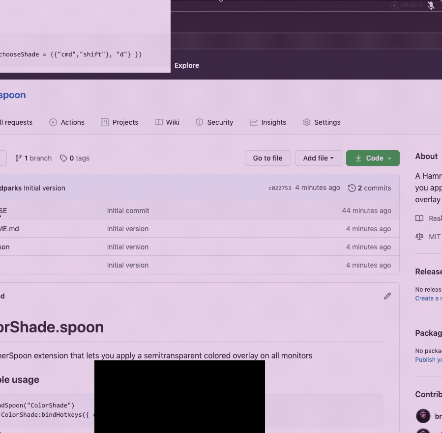

# ColorShade.spoon
- A [Hammerspoon](https://www.hammerspoon.org/) extension that lets you apply a semitransparent colored overlay on all monitors. 
- It's kind of like a better version of the Mac's Night Shift feature, with colors!
- Supports setting both transparency and color per monitor, or for all monitors.
- Allows you to save your current settings as a layout.
- Provides a chooser dialog to easily search for and apply configurations.

### Demo


### How to install
- Download the [ColorShade.spoon](https://github.com/bradparks/ColorShade.spoon/blob/main/ColorShade.spoon?raw=true) file, and double click on it.

### How to install from source
- Clone repo to your hammerspoon spoons folder

```
$ cd ~/.hammerspoon/Spoons/
$ git clone https://github.com/bradparks/ColorShade.spoon.git 
```

### How to add it to your Hammerspoon configuation 
- Add the following to your `~/.hammerspoon/init.lua`

```
hs.loadSpoon("ColorShade")
spoon.ColorShade:bindHotkeys({ chooseShade = {{"cmd","shift"}, "d"} })
```

### Additional info
- License MIT
- [Based on the Shade Spoon](https://github.com/Hammerspoon/Spoons/blob/master/Source/Shade.spoon/)
